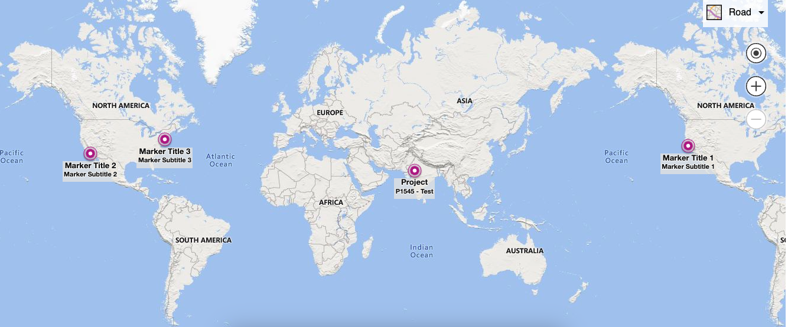

# Bing map

## Description

This project demonstrates how to integrate Bing Maps into a web application to display location markers on a map.

## Features

- Displays a map using Bing Maps API.
- Adds multiple custom location markers to the map.
- Customizes marker icons and sizes.
- Centers the map on a specific location.

## Key Generate
1. Sign Up: If you don't already have one, create a Microsoft account. You can sign up for free.

2. Visit Bing Maps Dev Center: Go to the Bing Maps Dev Center website.

3. Sign In: Sign in with your Microsoft account credentials.

4. Create a New Project: Create a new project or choose an existing one if you have any.

5. Generate API Key: Once you're in your project's dashboard, look for the option to generate an API key. Follow the instructions to create a new API key.

6. Configure Key: Configure the API key with the necessary permissions and restrictions based on your needs. You can typically restrict the key to specific domains to enhance security.

7. Access and Use: Once you've generated the API key, you can use it in your application by including it in the appropriate API requests or configuration settings.

Please note that the exact steps might vary based on the Bing Maps Dev Center's interface and any updates that have been made since my last knowledge update in September 2021. Make sure to review any documentation or guides provided by Bing Maps for the most up-to-date instructions on generating an API key.

## Installation

1. Clone this repository: `git clone https://github.com/Sonubairwa2021/bing-map.git`
2. Navigate to the project directory: `cd your-repo`
3. Obtain a Bing Maps API key by following [these instructions](https://docs.microsoft.com/en-us/bingmaps/getting-started/bing-maps-dev-center-help/getting-a-bing-maps-key).
4. Open `index.html` in a text editor.
5. Replace `'YOUR_API_KEY'` with your actual Bing Maps API key.
6. Open `index.html` in a web browser to see the map with location markers.

## Usage

- Drag the map to explore different locations.
- Click on the markers to view marker information.
- Customize the locations and marker icons in the `index.html` file.

## Screenshot

## Credits

- [Bing Maps API](https://www.bing.com/maps/)
- Icons used from [Iconfinder](https://www.iconfinder.com/)

## License

This project is licensed under the MIT License - see the [LICENSE](LICENSE) file for details.

